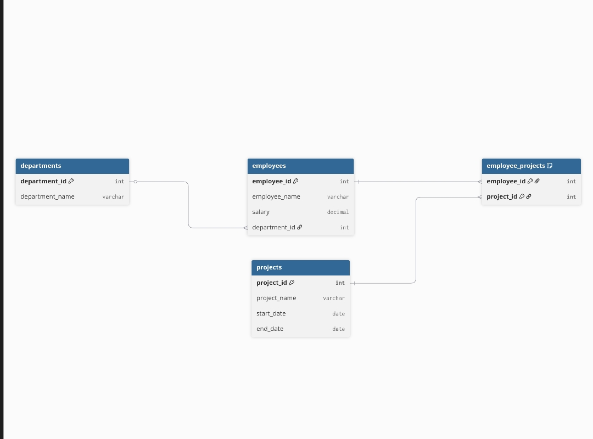

# Employee Management System - SQL

This project demonstrates a SQL-based Employee Management System 
designed to practice database design, relationships, and advanced queries.

---

## 📌 Database Structure

The database contains the following tables:

- **departments** – Stores department details
- **employees** – Stores employee information
- **projects** – Stores project details
- **employee_projects** – Many-to-Many relationship table

---

## 🛠 Concepts Implemented

- Primary Key
- Foreign Key
- CHECK constraint
- UNIQUE constraint
- One-to-Many relationship
- Many-to-Many relationship
- INNER JOIN
- GROUP BY
- HAVING
- Subqueries

---

## 💡 Sample Query Example 

```sql
SELECT d.department_name, SUM(e.salary) AS total_salary
FROM employees e
JOIN departments d ON e.department_id = d.department_id
GROUP BY d.department_name;

---
## ER Diagram


